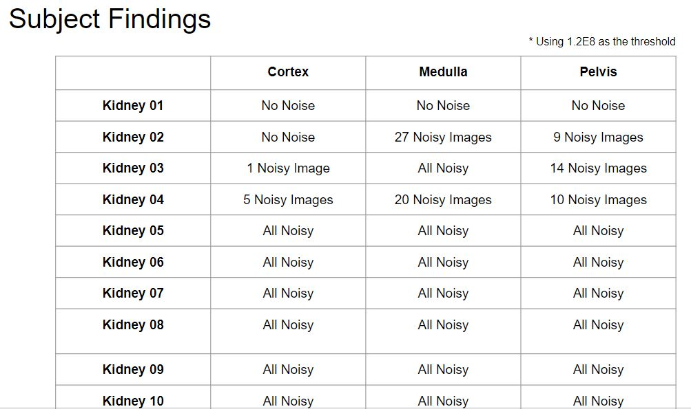

# Honors 3980 Research
## By: Parker Brandt (parker.a.brandt-1@ou.edu)
## In Conjunction With: Adrien Badre PhD (adrien.f.badre-1@ou.edu), Sinaro Ly Master's(sinaro.ly@ou.edu)
## Advised by: Dr. Chongle Pan (cpan@ou.edu)

GitHub Link: https://github.com/parkerbrandt/hon3980-research

### How to Run

To run the program, navigate into the '/code/' folder by doing:

`cd hon3980-research/code/`

From there, use Python to execute the code by executing on the command-line:

`python data_processing.py ../configs/config.json`

This will then run the code and tell the program that the necessary configurations are located in that config.json file. The user can edit config.json to change how they want the code to run.

### How it Works

### Demo

### Materials
    - Jupyter Notebook / Python

### The Problem

    Given 3-dimensional images

### Methods & Algorithms

#### Rotation & Cropping

#### Extending the Dataset

#### Image Noise

### Results

#### Rotation & Cropping

The first results I obtained were in creating the rotation function in

`code/data_processing.py/rotate_image()`

After creating this function, I tested by rotating an example image through the Z-Axis multiple times, and displaying it from a top-down view.

#### Image Noise

### Conclusion

Over the course of the Fall 2022 semester, I have learned about machine learning and image preprocessing techniques. I have learned practical uses for Python libraries such as numpy, scipy, and TensorFlow. 

### What's Next?

#### Machine Learning Training
As of 12/14/2022, we have gotten results for the first 