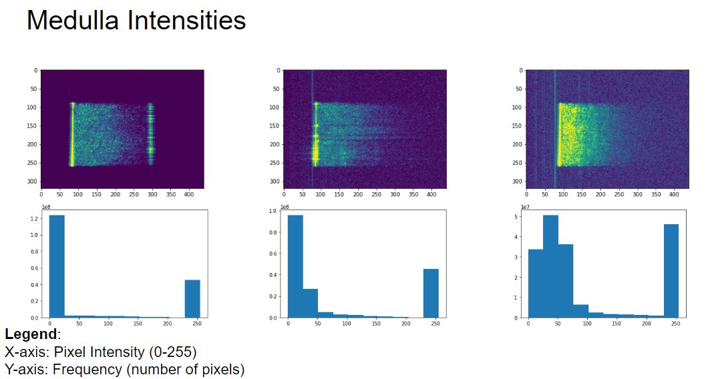

# Honors 3980 Research Lab Report: Data Preprocessing for Machine Learning
## By: Parker Brandt (parker.a.brandt-1@ou.edu)
## In Conjunction With: Adrien Badré PhD (adrien.f.badre-1@ou.edu), Sinaro Ly MS (sinaro.ly-1@ou.edu)
## Advised by: Dr. Chongle Pan (cpan@ou.edu)

GitHub Link: https://github.com/parkerbrandt/hon3980-research

## How to Run

To run the program, navigate into the '/code/' folder by doing:

`cd hon3980-research/code/`

From there, use Python to execute the code by executing on the command-line:

`python data_processing.py ../configs/config.json`

This will then run the code and tell the program that the necessary configurations are located in that config.json file. The user can edit config.json to change how they want the code to run.

## How it Works

When calling 'data_processing.py', the script performs multiple tasks to analyze and create data:

1) Read the configuration file.
    - Held in the configs folder, describes data about how to modify and store data

2) Retrieve the paths/filenames of all of the input images.

3) Check the noise level of each image, then remove all 'noisy' images.
    - Noise detection is done in 'code/image_noise_detection.py'
    - Uses the number of non-zero pixels as a way to determine noise
    - Will output data about the noise levels such as histograms containing the non-zero pixel count frequencies
    - Also will output average images before and after removing the noisy images
        - Done in 'code/image_analysis.py"

4) For each 'clean' image, crop the image, then rotate n times according to configuration file.
    - Then, save those images as a specified file type to the output folder

5) Then, those images are used as input for training and validating the machine learning model
    - Model used by group is stored in 'code/ml/3dcnn.py'

## Demo

## The Problem

Part 1: 
Given 3-dimensional images of kidney classes, can we create a machine learning model that can classify those 3-dimensional images to which class of kidney tissue the image belongs to accurately.

Part 2: 
Can we use the existing image data set to create more images to train the machine learning model further? If so, how can we change the images to provide more data to the model for greater accuracy?

## Materials
    - OU OSCER Supercomputer : /ourdisk/hpc/nullspace/adbadre/auto_archive_notyet/tape2_copies/image_project/
    - Jupyter Notebook / Python
        - Most of work done for actual data analysis done here on OSCER
    - Git / GitHub
        - Pipeline work done on https://github.com/thepanlab/medical-imaging-framework/tree/processing_3d
    - 900 3D Images provided by Dr. Qinggong Tang (qtang@ou.edu) and Chen Wang (chen_wang_ou@ou.edu)
        - 10 different subjects
        - 3 classes each (cortex, medulla, pelvis) with each class having 30 3D images
        - Stored as .tiff files

## Methods & Algorithms

#### Rotation & Cropping

To generate more data for the machine learning model that we were using, we were going to use a previously provided dataset from Dr. Tang and Chen Wang, then rotate and crop each of the 3-dimensional images. This would allow us to provide more data to the model for training and validation without having to try and find more subjects and images.

For rotation, I used

`scipy.ndimage.rotate(image, angle, axes=(0,2), reshape=False)`

from the scipy Python library. This function allowed me to rotate 3-Dimensional images through an axis that I could specify. This function operates by using spline interpolation to alter the original image, and filling in empty spaces with a constant 0 value.

#### Extending the Dataset

Once rotation and cropping functions were implemented, I then created a function, 

`create_dataset(image_paths, output_path, n, outimg_format="csv")`

that then iterates through the provided images in image_paths, performs the cropping, rotates n times, then outputs in the specified format. 

#### Image Noise

Once we had found that a significant amount of noise existed in the dataset, we needed ways to determine how much noise there was per image. To do this, we came up with two different ways of determining noise. 

    1) Sum the values of each individual pixel, then plot on a histogram.

    2) Count the number of non-zero pixels in the entire image

We found that option (2) was more accurate as option (1) could be influenced by a fewer number of higher intensity pixels, whereas more noise could exist in another image with more pixels with lower intensities. We then were able to determine cutoffs for noisy images per Kidney class.

To get a visual understanding of the impact of noisy images, we would create an "average image". This would average the pixels values across each class, then display. We would create average images before removing noisy images, and then after removing them to demonstrate how much the noise could affect the images.

Average images are created in 

`create_avgimage(files)`

in 'code/image_analysis.py' by summing each provided images' values, and then displaying the image.

Results will be expanded upon in the 'Results' section below.

## Results

#### Rotation & Cropping

The first results I obtained were in creating the rotation function in

`code/data_processing.py/rotate_image()`

After creating this function, I tested by rotating an example image through the Z-Axis multiple times, and displaying it from a top-down view.

Once we had finished implementing the cropping and rotation functions, we found that there had been an issue when putting the algorithms into practice, not all of the images were cropped properly. For example, 

The images were supposed to be centered after cropping and rotation, but the noise in the images was influencing the cropping algorithm, which then caused the resulting image to not be centered around the circle in the image.

#### Image Noise

Next, we needed a way to find which images had a lot of noise, so that we could remove them from the dataset, and only work with the clean images. This would not be feasible to do manually, so we needed to find a way to determine between a clean and noisy image. As mentioned above in the 'Methods & Algorithms' section, we tested using the sum of all values of the pixels in an image compared to using the number of non-zero pixels in an image.

For the method of summing the values of all pixels in an image, we took all 900 3-Dimensional images, divided them by class, then created histograms to show the frequencies of sum intensities, and find if there are easy to determine cutoff points between clean and noisy images. 

In the histograms, the X-Axis is the total sum of all the pixels in an image, and the Y-Axis is the number of images that have that sum.

From these histograms, we found that there was not an easy to determine cutoff point in the histograms, as we were hoping for a bimodal distribution. From here, we figured we needed another way to test for noisy images, and then decided to go with testing the non-zero pixel count method.

When testing using the non-zero pixel count as a way to determine noise, we performed a similar experiment, and also created histograms for each class. The X-Axis is the total number of non-zero pixels in the images, and the Y-Axis is the number of images with that count.

These histograms showed a much clearer disparity between the images with a lower non-zero count, and the images with a higher non-zero count. Using this, we have a clear cutoff for what can consist a clean image, and a noisy image.

After settling on using non-zero count as a valid way of determing which images are noisy or not, we then went through each of the subject's kidneys and classes we had access to and classified each image as noisy or not. The results are found in the table below:

|           | Cortex            | Medulla           | Pelvis            |
|-----------|-------------------|-------------------|-------------------|
|Kidney_01  | No Noise          | No Noise          | No Noise          |
|Kidney_02  | No Noise          | 27 Noisy Images   | 9 Noisy Images    |
|Kidney_03  | 1 Noisy Image     | All Noisy Images  | 14 Noisy Images   |
|Kidney_04  | 5 Noisy Images    | 20 Noisy Images   | 10 Noisy Images   |
|Kidney_05  | All Noisy Images  | All Noisy Images  | All Noisy Images  |
|Kidney_06  | All Noisy Images  | All Noisy Images  | All Noisy Images  |
|Kidney_07  | All Noisy Images  | All Noisy Images  | All Noisy Images  |
|Kidney_08  | All Noisy Images  | All Noisy Images  | All Noisy Images  |
|Kidney_09  | All Noisy Images  | All Noisy Images  | All Noisy Images  |
|Kidney_10  | All Noisy Images  | All Noisy Images  | All Noisy Images  |

** Using a cutoff of 1.2E8 nonzero pixels as a cutoff

There are also example histograms from individual kidneys showing the distribution of each of their 3 classes, and 30 images per class:

Once we classified the amount of noise in the dataset, we were curious how influential the noise actually was. First, we took the entire distribution of images per kidney class, then took a singular image from a lower point in the distribution, the middle point, and then the end point to see an example of a low noise image, a medium noise image, and then a high-noise image:

The example images make it easy to see how the noise evolves over the distribution.

The next step in the process was to determine how much noise was too much for the images, and where we should actually cutoff. We were trying to decide if it was worth it to try and save more images if they may not have affected the data as much. To decide this we created average images. This was done by taking the values of pixels across images and summing them, then displaying the image. We did this for each class, and we did this by creating an average image from all the "low-noise" images, then making another including the images with some noise. 

A main concern with using more noise for the machine learning model was that the noise can make it hard to ascertain where the actual signal of the image ends or not. As can be seen in the individual example images, it can be hard for even a human to decide where the actual image signal ends, and where there is just noise. This could make it difficult for a machine learning model to even decide, and not make invalid guesses when trying classify kidney class types.

While we have not moved forward with using this method as a way to determine if an image is noisy or not, we did take 3 example images from each class, and then plot their individual pixel values on a histogram. Each class has an example image (from left to right) that is low-noise or no noise, medium-noise, and then high-noise to show how the distribution of their actual pixel values changes with more and more noise added. The example images are also displayed above the histograms for a visual.

The difference in distributions is interesting, and could be used as another method of determining the level of noise in an image.

## Conclusion

Over the course of the Fall 2022 semester, I have learned about machine learning and image preprocessing techniques, and how data preprocessing and data generation is necessary for some machine learning models to work. Through the obstacles that my group have faced in trying to generate a data set, I have learned practical uses for Python libraries such as numpy, scipy, and TensorFlow. Those obstacles showed me how much work can go into data generation and maintenance for machine learning. Working with Adrien, Sinaro, Dr. Pan, and the others in the lab has helped me learn more about working with a team, and how much coordination can go into such a project.

## What's Next?

#### Machine Learning Training
As of 12/14/2022, we have gotten results for the first iterations of the machine learning model training and validation. The validation accuracy has varied much, but it shows promise if we are able to make the model more consistent.

